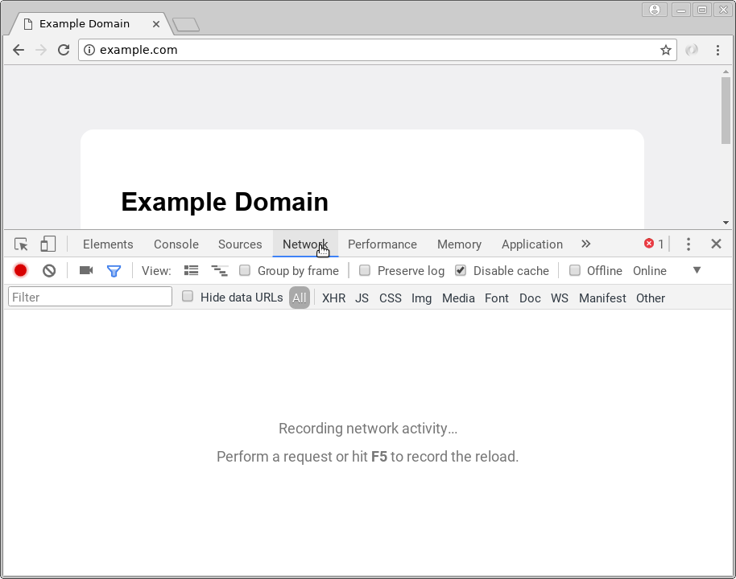
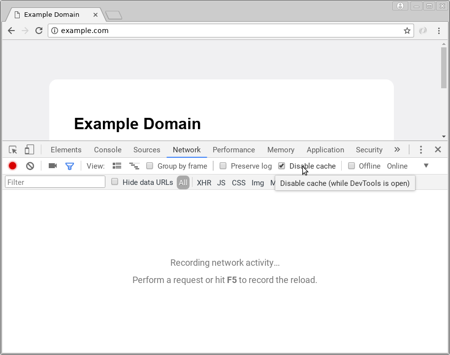
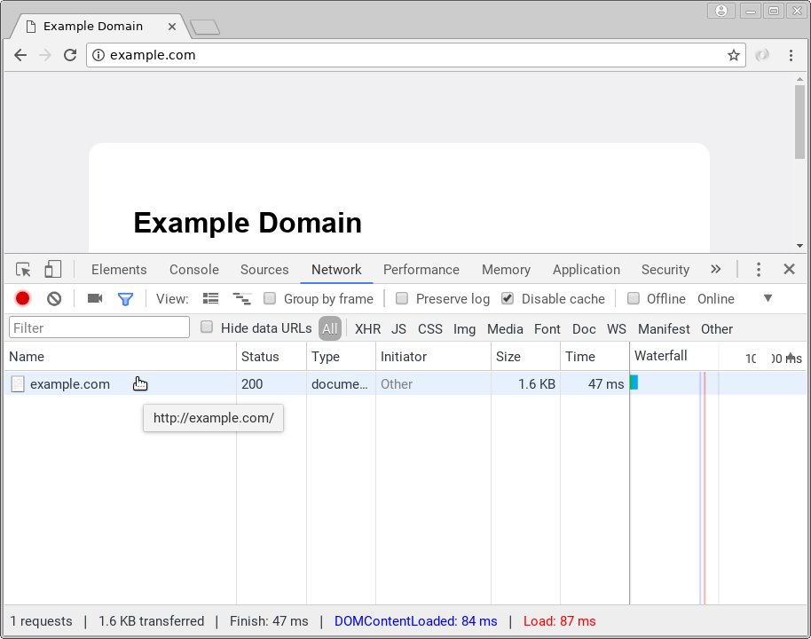
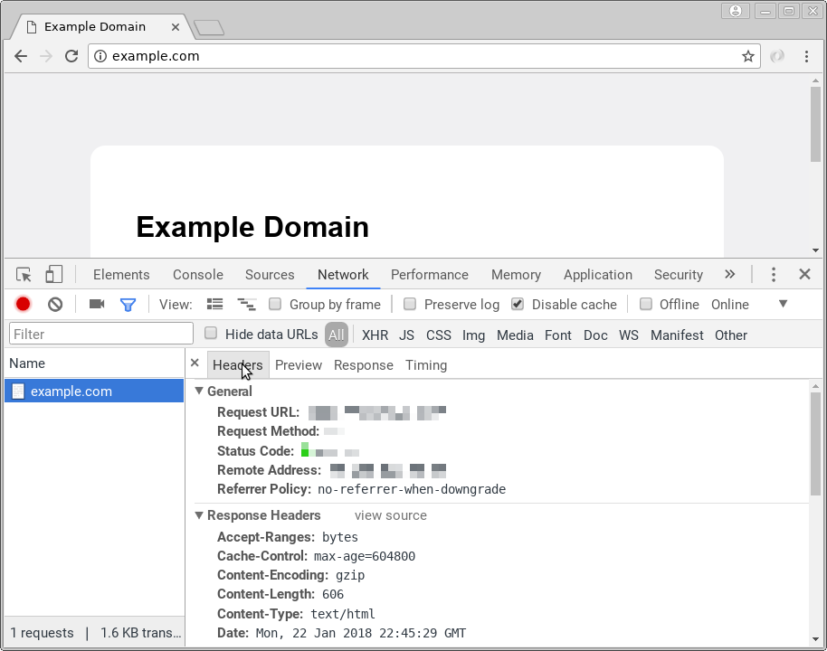

% Lab 2: Introduction to HTTP
% CMPUT 296; written by Eddie Antonio Santos
% January 22, 2018

Overview
========

 - Use your browser's developer tools to investigate HTTP
 - Learn about HTTP requests
 - Learn about HTTP request/response headers
 - Learn about HTTP status codes

Materials
=========

 - Google Chrome/Chromium (the instructional staff does not officially
   provide support for other browsers, although all major modern
   browsers have comparable functionality)
 - An internet connection

Procedure
=========

Submit your responses to the questions in this lab on eClass.

> **Question X**. Questions look like this.

**Remember to cite your sources**.

Introduction
------------

A common job interview question is,

> In as much detail as possible, describe what happens after I type
> "example.com" in my browser and press <kbd>Enter</kbd>.

In this lab, we will investigate one crucial component of this process:
the Hypertext Transfer Protocol (HTTP). To do this, we will open up
[Google Chrome's DevTools][devtools].

To access these Chrome's DevTools from any open tab, do one of the
following following:

 * (Linux/Windows) Press <kbd>Ctrl</kbd> + <kbd>Shift</kbd> + <kbd>I</kbd>
 * (macOS): Press <kbd>Cmd</kbd> + <kbd>Option</kbd> + <kbd>I</kbd>
 * (Any platform) Click the main drop-down menu > "More Tools" > "Developer Tools"

[devtools]: https://developers.google.com/web/tools/chrome-devtools/

The DevTools may appear "docked" to the bottom of your browser window,
docked to the right side of the window or as a new window entirely. Use
whichever configuration you find most convenient.

The rest of the lab will assume the following:

DevTools are open on the **Network** panel:

In the **Network** panel, **Disable Cache** is clicked.

Investigating an HTTP request
-----------------------------

Navigate to <http://example.com/>.

Open the DevTools. Switch to the Network panel. Ensure "Disable cache"
is on.

Refresh the page (Linux/Windows: <kbd>F5</kbd>, macOS: <kbd>Cmd</kbd>
+ <kbd>R</kbd>).

In the network panel, there should be a list of requests. Click the
request whose name is `example.com`.

Ensure you are viewing the "Headers" tab within the "Network" panel for
`example.com`.

For the next question, study the information under the "General"
heading.

> **Question 1**: For this request, what is the request URL?
> What request method was used? What its status code?
> What is the IP address and port of the webserver hosting "example.com"?

Now, navigate to <http://example.com/probably-does-not-exist-hopefully.html>.
Repeat the same steps as for question 1. To reiterate:

Ensure the DevTools are open. Switch to the Network panel. Ensure
"Disable cache" is on.

Refresh the page (Linux/Windows: <kbd>F5</kbd>, macOS: <kbd>Cmd</kbd>
+ <kbd>R</kbd>).

In the network panel, there should be a list of requests. Click the
request whose name is `probably-does-note-exist-hopefully.html`.

Ensure you are viewing the "Headers" tab within the "Network" panel for
`probably-does-note-exist-hopefully.html`.

For the next question, study the information under the "General"
heading.

> **Question 2**: For this request, what is the request URL?
> What request method was used? What its status code?
> What is the IP address and port of the web-server hosting `example.com`?

> **Question 3**: What changed between requesting <http://example.com>
> and <http://example.com/probably-does-not-exist-hopefully.html> (in
> the information under the "General" heading only)?

> **Question 4**: Explain the difference between the status codes you
> received on <http://example.com> and
> <http://example.com/probably-does-not-exist-hopefully.html>.
> What do these status codes mean?

Navigate to <https://en.wikipedia.org/wiki/Main_Page>.
Repeat the same steps as for questions 1 & 2. To reiterate:

Ensure the DevTools are open. Switch to the Network panel. Ensure
"Disable cache" is on.

Refresh the page (Linux/Windows: <kbd>F5</kbd>, macOS: <kbd>Cmd</kbd>
+ <kbd>R</kbd>).

In the network panel, there should be a list of requests. Unlike the
previous requests to `example.com`, there should be a substantial number
of requests. Click the request whose name is `Main_Page` (usually at the
very top of the list).

Ensure you are viewing the "Headers" tab within the "Network" panel for
`Main_Page`.

For the next question, study the information under the "General"
heading.

> **Question 5**: For this request, what is the request URL?
> What request method was used? What its status code?
> What is the IP address and port of the web-server hosting `example.com`?

Carefully compare the request to Wikipedia's Main Page to the
requests to `example.com`.

> **Question 6**: Why does the IP address (the part _before_ the colon
> in the "Remote Address" field) change between the requests to
> Wikipedia and `example.com`?

> **Question 7**: Why does the **port** (the part _after_ the colon in
> the "Remote Address" field) change between the requests to Wikipedia
> and `example.com`? Hint: look at the very beginning of the URLs.

HTTP headers
------------

<!-- Content type questions: -->

Navigate to <https://www.ualberta.ca/>.
Repeat the same steps as for questions 1, 2, & 5. To reiterate:

Ensure the DevTools are open. Switch to the Network panel. Ensure
"Disable cache" is on.

Refresh the page (Linux/Windows: <kbd>F5</kbd>, macOS: <kbd>Cmd</kbd>
+ <kbd>R</kbd>).

In the network panel, there should be a list of requests. Click the
request whose name is `www.ualberta.ca` with a status of 200 (usually
at the very top of the list).

Ensure you are viewing the "Headers" tab within the "Network" panel for
`www.ualberta.ca`.

For the next question, study the information under the "Response Header"
and "Request Headers" headings.

> **Question 8**: Copy the value of the **Accept** request header as the
> answer to this question (`www.ualberta.ca/`).

> **Question 9**: Copy the value of the **Content-Type** response
> header as the answer to this question (`www.ualberta.ca/`).

The **Accept** header indicates the type(s) of resource your browser
expects the HTTP server at `www.ualberta.ca` to send. The
**Content-Type** header, in turn, indicates what type of resource the
server ultimately replied with. Instead of indicating file types with
file extensions (like `.html`, `.jpg`, `.docx`, `.exe`), HTTP
communicates file types with [MIME
types](https://developer.mozilla.org/en-US/docs/Web/HTTP/Basics_of_HTTP/MIME_types).

> **Question 10**: Study your answers to questions 8 & 9. In plain
> English, explain which file types your browser was expecting
> to receive (e.g., did it want a Word document? Did it want
> a JavaScript file? Did it want an .mp4 video file? Did it want a JPEG?
> Did it want an XML document?). List all file types that apply.

> **Question 11**: What file type did the browser receive from the
> server? How does your browser know this?

Close the details for the request to `https://www.ualberta.ca/` so that
you can see the list of all of the other requests. Scroll down the list
for a request called `custom.css`.  <!-- IMPORTANT! This may change in
future versions of the website --> Click to view this request's details.

> **Question 12**: Copy the value of the **Accept** request header as the
> answer to this question (`custom.css`).

> **Question 13**: Copy the value of the **Content-Type** response
> header as the answer to this question (`custom.css`).

`custom.css` is a Cascading Stylesheet (CSS) file, which specifies the
fonts, colours, and layout of the webpage. We will be covering CSS later
in this course. What's important to know now is that the browser was
instructed by the webpage to fetch some sort of styling information from
the server (e.g., CSS).

> **Question 14**: Why do you see a difference between the **Accept**
> header for the request to `www.ualberta.ca` (question 8) in contrast
> to the request for `custom.css` (question 12)?

### `Host` header

Navigate to <http://example.com/>.
Repeat the same steps as for questions 1. To reiterate:

Ensure the DevTools are open. Switch to the Network panel. Ensure
"Disable cache" is on.

Refresh the page (Linux/Windows: <kbd>F5</kbd>, macOS: <kbd>Cmd</kbd>
+ <kbd>R</kbd>).

In the network panel, there should be a list of requests. Click the
request whose name is `example.com`.

Ensure you are viewing the "Headers" tab within the "Network" panel for
`example.com`.

> **Question 15**: Copy the request address and the **Host** response
> header as the answer to this question (`example.com`).

Navigate to <http://example.org/>. That's `.org`, not `.com`!
Repeat the same steps as for questions 14. To reiterate:

Ensure the DevTools are open. Switch to the Network panel. Ensure
"Disable cache" is on.

Refresh the page (Linux/Windows: <kbd>F5</kbd>, macOS: <kbd>Cmd</kbd>
+ <kbd>R</kbd>).

In the network panel, there should be a list of requests. Click the
request whose name is `example.org`.

Ensure you are viewing the "Headers" tab within the "Network" panel for
`example.org`.

> **Question 16**: Copy the request address and the **Host** response
> header as the answer to this question (`example.org`).

Navigate to <http://example.net/>. That's `.net`, not `.com` or `.org`!
Repeat the same steps as for questions 14. To reiterate:

Ensure the DevTools are open. Switch to the Network panel. Ensure
"Disable cache" is on.

Refresh the page (Linux/Windows: <kbd>F5</kbd>, macOS: <kbd>Cmd</kbd>
+ <kbd>R</kbd>).

In the network panel, there should be a list of requests. Click the
request whose name is `example.org`.

Ensure you are viewing the "Headers" tab within the "Network" panel for
`example.org`.

> **Question 17**: Copy the request address and the **Host** response
> header as the answer to this question (`example.net`).

Compare the responses you got for `example.com`, `example.org`, and
`example.net`. Particularly, compare the remote address.

> **Question 18**: As a simplification, assume that one **IP
> address/port number** pair uniquely identifies a server running on one
> machine. How many HTTP servers are running for `example.com`,
> `example.org`, and `example.net` in total?

> **Question 19**: I have one HTTP server handling the requests for
> multiple domains. Describe how my HTTP server can use HTTP request
> headers to determine which domain a particular request is intended
> for (e.g., how does my HTTP server know whether to send the content
> for `example.org` instead of content for `example.com`?).

HTTP methods and status codes
-----------------------------

Use the [Hypertext Coffee Pot Control Protocol (HTCPCP)][HTCPCP] to
`GET` some coffee from Google's teapot, located at
<https://google.com/teapot>.

> **Question 20**: What is the HTTP status code for using `GET` on
> <https://google.com/teapot>?

> **Question 21**: In general, what do status codes in the 4xx series
> mean (i.e., what is in common for status codes 404, 401, 400, 403,
> etc.)? Why does <https://google.com/teapot> give you the status code
> in the 4xx series?

[HTCPCP]: https://tools.ietf.org/html/rfc2324
