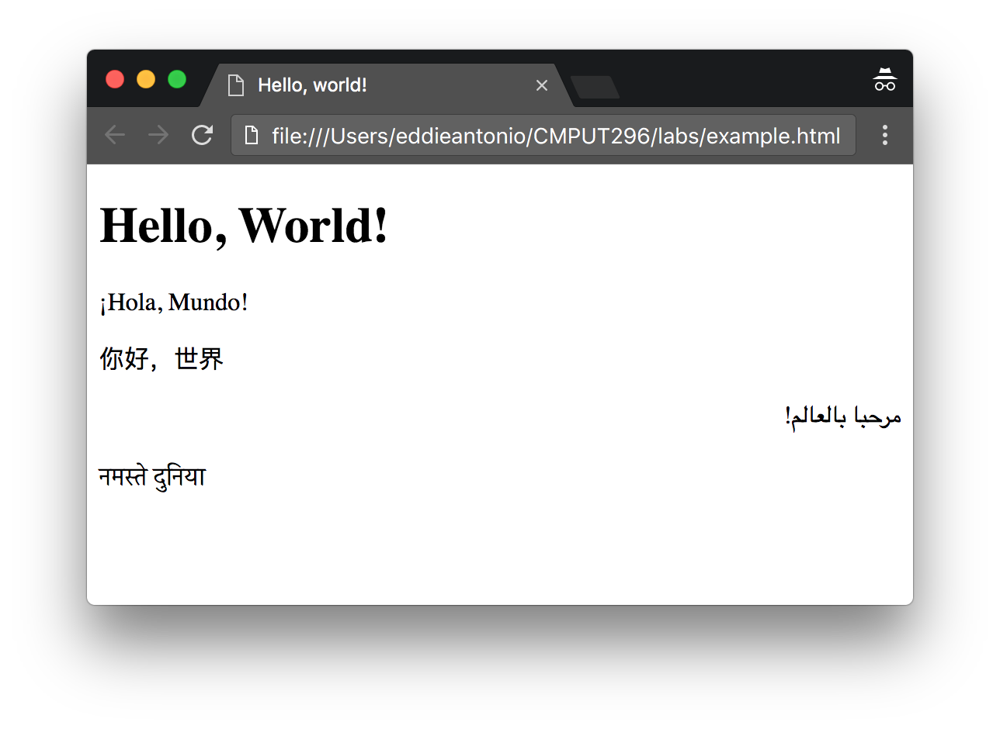

% Lab 4: Introduction to HTML
% CMPUT 296; written by Eddie Antonio Santos
% February 5, 2018

Overview
========

 - ...

Materials
=========

 - An internet connection
 - A modern web browser (like Firefox or  Google Chrome)
 - A text editor (with good Unicode support!)


Procedure
=========

Submit your responses to the questions in this lab on eClass.

> **Question X**: Questions look like this.

**Remember to cite your sources**.

# What is HTML?

The **Hypertext Markup Language** defines the structure and content of
a webpage. In this lab, we'll modify some small HTML documents
to get a better understanding of the structure of HTML.

Quick HTML syntax refresher
---------------------------

In HTML, there are

<!-- what part does modifying <title> affect? -->
<!-- what part does modifying <h1> affect? -->

---

```html
<!DOCTYPE HTML>
<html lang="en">
   <head>
      <meta charset="UTF-8">
      <title>Hello, world!</title>
      <link rel="stylesheet" href="...">
   </head>
   <body>
      <h1>"Hello, World!</h1>
      <p> Listed in the top 5 languages by speaker. </p>

      <ol>
        <li lang="zh">你好，世界</li>
        <li lang="hi">नमस्ते दुनिया<li
        <li lang="es">¡Hola, Mundo!</li>
        <li lang="ar" dir="rtl">مرحبا بالعالم!</li>
      </ol>

      <p>And finally, "Hello, world" in emoji: 👋🌎</p>
   </body>
</html>
```

<!-- give mini syntax lessons -->

<!-- how many children of the <body> tag? -->

<!-- attributes and ids:

 1. take earlier lorem ipsum page and download it.
 2. add ids to it to make it scroll.
 3. copy the lines changed as the answer

-->

# `<meta charset="...">`

<!--
Assume they already know attributes by here.

-->

Copy the above example to and paste it into a new text file (use your
favourite text editor). Save that text file as `example.html`. Now open
that file from your file manager. It should open in your default
browser and display something like this:

<!-- screenshot of intended rendering: -->

<!-- download link for this page. -->



> **Question 1**: When this page opened in your browser, did it use
> HTTP? Provide evidence for your answer (hint: look at the URL).

<!--
 Encodings list:
  - US-ASCII
  - GB-18030
  - GB-2312
  - ISO-8859-1
  - CP1250
  - KOI cyrillic encoding
  - Shift-JIS
-->

<!-- render without meta charset line -->
<!-- render trying different encodings -->
<!-- why is UTF-8 the only possible encoding for the characters on this
     page? this questino will be difficult to word...

     Say I'm saving this file, and the text editor is asking me what
     character encoding to use. Why is UTF-8 the only possible 8-bit
     encoding to use?
     -->

<!-- Question involving messing around with meta tags -->

<!-- Question involving <title> tag: stuff in body is the content in the
     viewport. -->

<!-- Question involving changing CSS styles -->

<!-- Question involving creating an <a href="..."> -->

<!-- Question involving creating an  -->

<!-- QUESTION INVOLVING FILE ENCODINGS! -->

<!-- teach them importance of escape chars: &lt; &gt; &amp; -->

<!-- teach them what an HTML comment is! -->

<!-- teach them to inspect with the dev tools -->

<!-- eventually get them to produce this: -->

<!-- use this as inspiration:
   http://ladieslearningcode.github.io/llc-html-css-one-page/slides.html#slide7
   http://ladieslearningcode.github.io/llc-html-css-one-page/slides.html#slide22
-->
