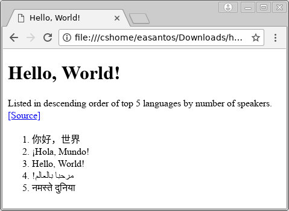

% Lab 4: Introduction to HTML
% CMPUT 296; written by Eddie Antonio Santos
% February 5, 2018

Overview
========

 - Understand the basic syntax of HTML documents
 - Be familiarized with a number of common HTML tags and attributes

Materials
=========

 - An internet connection
 - A modern web browser (like Firefox or  Google Chrome)
 - A text editor (with good Unicode support!)


Procedure
=========

Submit your responses to the questions in this lab on eClass.

> **Question X**: Questions look like this.

**Remember to cite your sources**.

# What is HTML?

The **Hypertext Markup Language** defines the structure and content of
a webpage. In this lab, we'll modify small HTML examples to get a better
understanding of HTML documents.

Quick HTML syntax refresher
---------------------------

<aside>
Note that while this lab pedantically distinguishes between the terms
**element** and **tag** (as per the [WHATWG][] standard), in common
discussion, you may hear people use these terms interchangeably such as
"Write a new `<a>` tag in your document" when they really mean "`<a>`
element". This is so common, your instructors may often mix these terms
up without realizing!
</aside>

[WHATWG]: https://html.spec.whatwg.org/multipage/introduction.html#a-quick-introduction-to-html

HTML is made up of nested **elements**, which are marked by a **start
tag**:

    <tag>

and terminated by an **end tag**:

    </tag>

Elements are often **nested**. Consider the following example:

    <html>
      <head>
        <title> </title>
      </head>
      <body>
      </body>
    </html>

In this example, the **root element** is `<html>`. `<html>` has two
**children** elements: `<head>` and `<body>`. Finally, `<head>` contains
one child element: `<title>`. The `<head>` and
`<body>` elements are **siblings**.

For questions 1 and 2, consider the following example:

    <body>
      <p> Hello, <strong>World</strong> </p>
    </body>


> **Question 1**: What element is the child of the `<body>` tag?

> **Question 2**: Does the `<p>` tag have any child elements? If so,
> what are they?

Attributes
----------

HTML elements may have **attributes**. Attributes are written **only**
in the start tag:

    <tag attribute-1="value 1" attribute-2="value 2">
      ... contents ...
    </tag>


Attributes are a way of specifying name/value pairs attached to an
element. Most of these name/value pairs are optional.

The "HT" in "HTML" stands for "Hypertext" which is the nature in which
different HTML documents can be linked together using *hyperlinks*. To
make a hyperlink in an HTML document, one must use an `<a>` element,
whose start and end tag surround the desired link text. The `<a>`
element **requires** the `href` attribute ("href" is short for
"hyperlink reference"), which specifies the URL which clicking the link
will go to. For example, here is a link to the homepage of `ualberta.ca`
with the clickable text being "University of Alberta homepage"

    <a href="https://www.ualberta.ca/">
      University of Alberta homepage
    </a>

This link will look like this: <a href="https://www.ualberta.ca/">
University of Alberta homepage</a>.

> **Question 3**: Provide the HTML code for a link whose link text is
> "Example domain" and clicking on it will go to `http://example.com/`.

> **Question 4**: Why is the `href` attribute required for the `<a>`
> element? Try to answer this question without consulting external
> resources.


Void elements
-------------

Some elements do not require an end tag. These are called *void
elements*.

`` is a void element. An `` element consists of
the image URL (its `src` attribute) and some alternative text (its `alt`
attribute). For example,

    

Notice how this the `` tag has no matching `</img>` end tag. The
result of this HTML code is embedding an image that looks like this:


> **Question 5**: Why is `` a void element? To answer this
> question, consider: what would the text content between the start and
> end `` tags mean?


A full HTML example
===================

We will be studying the following full HTML document, modifying it, and
describing the effects of our modifications. Either copy-paste the
example below and save it to a file called `hello.html`, or download it
here:
<a href="lab-4/hello.html" download>hello.html</a>.

```html
<!DOCTYPE html>
<html lang="en">
   <head>
      <meta charset="UTF-8">
      <title>Hello, World!</title>
   </head>
   <body>
      <h1>Hello, World!</h1>
      <p>
        Listed in descending order of top 5 languages by number of
        speakers.
        <a href="https://www.ethnologue.com/statistics/size">
          [Source]
        </a>
      </p>

      <ol>
        <li lang="zh">你好，世界</li>
        <li lang="es">¡Hola, Mundo!</li>
        <li lang="en">Hello, World!</li>
        <li lang="ar"><span dir="rtl">مرحبا بالعالم!</span></li>
        <li lang="hi">नमस्ते दुनिया</li>
      </ol>
   </body>
</html>
```

The `<!DOCTYPE>`
----------------

HTML has evolved quite a lot over the years. Most moderns browsers
support the [HTML 5 living standard][HTML5], however they remain
backwards-compatible with older versions of HTML. As such, a mechanism
was devised to specify the HTML version used by the page. This is called
the "document type declaration", or simply "doctype" for short. If
specified, this must be at the very top of the HTML document.

The HTML 5 doctype looks like this:

    <!DOCTYPE html>

If present at the very beginning of the document, the browser is sure to
render your document using the HTML 5 standard.

> **Question 6**: Search the internet for the doctype declaration of an
> older version of the HTML standard, such as HTML 4.01, or XHTML 1.1,
> and paste it as the answer to this question. Hint: older doctypes were
> *very* long.

[HTML5]: https://html.spec.whatwg.org/


The `<html>` element
--------------------

The entirety of an HTML document is contained within the `<html>`
element. Often, the `<html>` element has exactly two children: `<head>`
and `<body>`.

> **Question 7**: What is the purpose of the `lang` attribute on the
> `<html>` element?


The `<title>` element
---------------------

Change the title of the page. In `hello.html`, modify the line that says

      <title>Hello, World!</title>

and change it to say "Goodbye, planet!", like the following:

      <title>Goodbye, planet!</title>

Save `hello.html` and reload the page in your browser (Windows/Linux:
<kbd>F5</kbd>; macOS: <kbd>Command</kbd> + <kbd>R</kbd>).

> **Question 8**:  Where did this change occur in your browser? Did it
> appear in the webpage or somewhere else?

The difference between the `<head>` and `<body>` element
--------------------------------------------------------

We saw how the `<title>` element is a child of the `<head>` element.
The content within the `<head>` is often *not* displayed on the webpage
itself; rather, things in the `<head>` element specify things that the
web browser and other *user agents* must be aware of, but will not
directly display in the "viewport", such as the character encoding of
the HTML document, where to find the CSS stylesheet associated with the
page, where to find any required JavaScript sources, and *meta
information* such as the page's author, the general title of the page,
and a general description to appear in search engine results.

Conversely, the `<body>` element contains content that *will* appear in
the "viewport", that is, what you regard as the text, images, and
multimedia that make up the web page when you view it in a browser.


The `<meta charset="...">` line
-------------------------------

This line specifies the **character encoding** of the HTML document.
Note that we will use the terms "charset", "character set", "encoding",
and "character encoding" interchangeably (they all mean the same thing).

In the original version of `hello.html`, I specified the encoding as
UTF-8.

      <meta charset="UTF-8">

We will see the effects of _not_ specifying the file encoding.

Make a mental note of how the webpage renders now in your browser.
Delete the `<meta charset="UTF-8">` line in the `hello.html`. Save the
HTML file, and reload the page in your browser (Windows/Linux:
<kbd>F5</kbd>; macOS: <kbd>Command</kbd> + <kbd>R</kbd>).

> **Question 8**: How does the page render now in your browser? How does
> it differ from when the `<meta charset="UTF-8">` line was present in
> the `<head>` element?

For reference, here is how the page renders on my computer _with_ the
charset declared as UTF-8:

<!-- todo: replace this with screenshots from the lab computers. -->



Now, add the line back to the file:

      <meta charset="UTF-8">

Change the `charset` attribute to one of the following character encodings:

 - `shift_jis`
 - `koi8_r`
 - `iso-8859-1`
 - `gb2312`

> **Question 9**: With a value for `charset` other than "UTF-8", describe
> how the webpage looks different.

<!-- why is UTF-8 the only possible encoding for the characters on this
     page? this questino will be difficult to word...

     Say I'm saving this file, and the text editor is asking me what
     character encoding to use. Why is UTF-8 the only possible 8-bit
     encoding to use?
     -->


Before continuing, delete any existing `<meta charset="...">` lines in
`hello.html` and replace it with what was there originally; namely:

      <meta charset="UTF-8">


Within the `<body>` element
-------------------------

As mentioned previously, elements within the `<body>` element are
displayed on the screen (the "viewport"). Many of the common elements
that go in the `<body>` tag describe the **semantic markup** of the
document. For example:

 - `<p>` -- denotes a **paragraph**
 - `<h1>` -- denotes a **level one heading**
 - `<ol>` -- denotes an **ordered list**
 - `<li>` -- denotes a **list item**

> **Question 10**: How many children does the `<body>` tag contain?
> Provide the start tag of each element.

Modify the content of the `<h1>` element from:

    <h1>Hello, World!</h1>

to:

    <h1>Jolly good day, there, chap!</h1>

Save the file, and reload the page.

> **Question 11**: What part of the page changed when you changed the
> content of the `<h1>` element?

Within the list item for the Arabic "hello, world" (list item 4), the
text itself is wrapped in a `<span dir="rtl"> </span>` element.

> **Question 12**: What is a `<span>` element? What is the purpose of
> this `<span>` element with the `dir="rtl"` attribute? Why did I only
> specify the `dir="rtl"` attribute for the Arabic example?

<!-- teach them importance of escape chars: &lt; &gt; &amp; -->
<!-- teach them what an HTML comment is! -->
