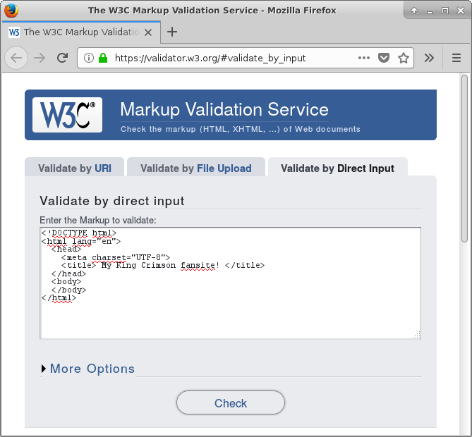
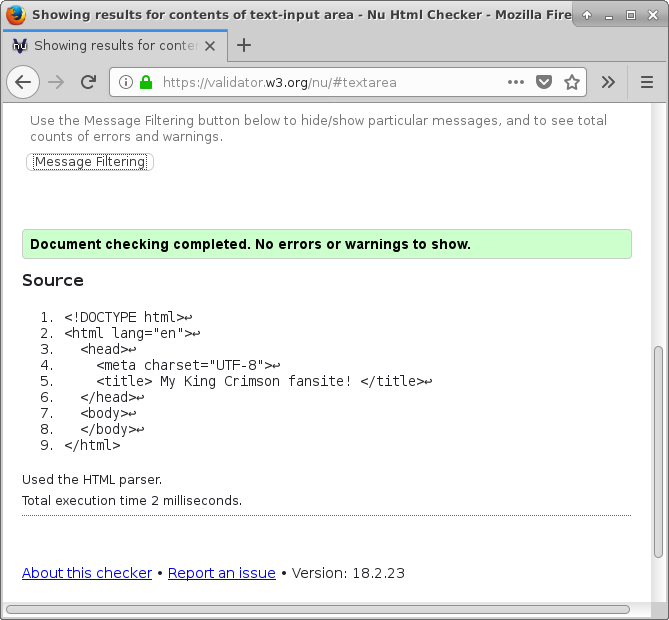

% Lab 6: Writing HTML & CSS from scratch
% CMPUT 296; written by Eddie Antonio Santos
% February 26, 2018

Overview
========

 - Create an HTML and CSS page from scratch
 - Create a form to GET information from an external resource


Materials
=========

 - A modern web browser (like Firefox or Google Chrome)
 - An internet connection
 - A text editor

Procedure
=========

Submit your responses to the questions in this lab on eClass.

> **Question X**: Questions look like this.

**Remember to cite your sources**.


Creating an band fan site from scratch using HTML and CSS
---------------------------------------------------------

In the first part of this lab, we'll be creating a fan site for your
favourite musical group (e.g., Evanescence, Girls' Generation, Maximum
the Hormone, Opeth, Spice Girls, etc.). If you don't have a favourite
band, make a [BTS][] fan site (the particular band doesn't matter).

We'll be writing this site from **scratch**. This means no use of site
generators, themes, Bootstrap, or any pre-written code. **Try as much as
possible to not copy-paste any code from the internet**. All the code
you'll write in your text editor should be typed out by hand (even if
you had to go consult the internet on how to do something in HTML and
CSS). There are only two exceptions to this recommendation: links like
<span style="text-overflow:ellipsis;display:inline-block;max-width:100%;white-space:nowrap;overflow:hidden;">https://upload.wikimedia.org/wikipedia/commons/c/ca/%EB%B0%A9%ED%83%84%EC%86%8C%EB%85%84%EB%8B%A8%28BTS%29_180110_%EC%A0%9C_32%ED%9A%8C_%EA%B3%A8%EB%93%A0%EB%94%94%EC%8A%A4%ED%81%AC.png</span>
are okay to copy-paste; [lorem ipsum][] text is also okay to copy-paste.
You will also be required to copy-paste the code _you_ have written as answers to
many questions in this lab.

[BTS]: https://en.wikipedia.org/wiki/BTS_(band)
[lorem ipsum]: https://www.webpagefx.com/tools/lorem-ipsum-generator/

Create the scaffolding
----------------------

Create a new text file called `index.html`. Inside this text file, type
the minimal HTML required for a valid HTML 5 page. You can find an
example in [your lecture
notes](http://webdocs.cs.ualberta.ca/~hindle1/2014/HTML-Slides/#/3).
Verify that it is valid HTML 5 by copy-paste the code you wrote into
the [W3C validator][validator].

[validator]: https://validator.w3.org/#validate_by_input





Do not continue until your minimal HTML passes the validator with
0 errors.

> **Question 1**: Copy-paste your minimal HTML (that passes the W3C
> validator) as the answer to this question.


Adding content
--------------

Write a title for your fan site. Place your title in the `<title>`
element and in a `<h1>` at the top your (displayed) page. Where should
these elements go in your code? Use the [validator][] to check that you
did it right.

> **Question 2**: What is the difference between the `<title`> and the
> `<h1>` tag?

Now, add some content to the `<body>` of your website. Write *at least*
3 paragraphs of content for your website. If you are feeling uncreative/lazy, you *may*
copy-paste at least 3 paragraphs worth of [lorem ipsum][] text. Either way,
wrap your paragraphs in the [appropriate HTML tags](http://webdocs.cs.ualberta.ca/~hindle1/2014/HTML-Slides/#/9).

> **Question 3**: Copy-paste the contents of your `<body>` tag up to
> as the answer to this question.


Apply some basic styles to your page
------------------------------------

Create a new CSS file in the same directory as `index.html` called
`styles.css`. Start this file off with:

```css
@charset "UTF-8";
```

You should at very least override the default font for the entire page.
Write the appropriate CSS ruleset that will change the `font-family` of
the entire page. Change the font to `sans-serif`, or any other font of
your choosing.

Create the appropriate `<link>` to make your page use `styles.css`.
Reload the page in your browser and ensure the font has changed
appropriately.

> **Question 4**: What
> [selector](https://codepen.io/eddieantonio/full/NygbJR/) did you use
> to change the font for the entire page? Why did you choose this
> selector?

> **Question 5**: Copy-paste your ruleset to change the font as the
> answer to this question.

> **Question 6**: Copy-paste your `<link>` element that includes the
> external CSS file as the  answer to this question.


Adding a figure
---------------

Add a image of the band, a band member, or the bands' logo to your page.
Search the web to find an appropriate image, and **copy where you got
the image from**. This is so that you can cite the source later.
Download this image to your computer in the same directory as
`index.html` and `style.css`. Add
a [`<figure>`](https://developer.mozilla.org/en-US/docs/Web/HTML/Element/figure)
element near the top of the page to contain your `` element. Your
`` tag within the `<figure>` element must link to the image you
just downloaded onto your computer. Below the `` element (and still
within the `<figure>` element), add a `<figcaption>` that has a written
caption for the image (e.g., "BTS at the 32nd Golden Disk Awards on
January 10, 2018"
[[1]](https://en.wikipedia.org/w/index.php?title=BTS_(band)&oldid=826907650)).
Within the end of the `<figcaption>`, create
a [hyperlink](http://webdocs.cs.ualberta.ca/~hindle1/2014/HTML-Slides/#/14)
**citing the source you got the image from**.


> **Question 7**: Copy-paste the entire contents of your `<figure>`
> element as the answer to this question.

Now, move the figure, image, caption, and all, to the right side of the
page.

To do this, use the
[`float`](https://developer.mozilla.org/en-US/docs/Web/CSS/float)
property to "float" your `<figure>` to the right of the page.
Add any additional styles to ensure your image and your caption due not
exceed one-half of the screen width. You may want to look at the
[`max-width`](https://developer.mozilla.org/en-US/docs/Web/CSS/max-width)
property.


> **Question 8**: Copy-paste the styles you just wrote for the
> `<figure>`, `<figcaption>`, and/or `` elements.


<!--

 - <figure> and <figcaption> [NEW] https://developer.mozilla.org/en-US/docs/Web/HTML/Element/figure https://developer.mozilla.org/en-US/docs/Web/HTML/Element/figcaption
 -  http://webdocs.cs.ualberta.ca/~hindle1/2014/HTML-Slides/#/13 attribute the work
 - make it float to the right of the content. give it some margin to put some space between it an the text. [NEW]
 - <a> http://webdocs.cs.ualberta.ca/~hindle1/2014/HTML-Slides/#/14
 - Use a <span> to apply inline styles http://webdocs.cs.ualberta.ca/~hindle1/2014/HTML-Slides/#/17
 - apply display: inline-block;
 - Maybe like a transform: rotate(12deg);
 - What happens when you remove display: inline-block from this span?
   Why does this happen?

 - <footer> at bottom
 - Use an HTML entity to add a copyright symbol to the bottom. [ NEW]
 - Use a font-size smaller to the footer.

 - A custom hyperlink style with :hover http://webdocs.cs.ualberta.ca/~hindle1/2014/HTML-Slides/#/32

 - Fancy Captital Letter for the first item of a paragraph WITHOUT modifying the HTML. Show the CSS. http://webdocs.cs.ualberta.ca/~hindle1/2014/HTML-Slides/#/32

---

<form action="http://localhost:8000/"> http://webdocs.cs.ualberta.ca/~hindle1/2014/HTML-Slides/#/38
<select> http://webdocs.cs.ualberta.ca/~hindle1/2014/HTML-Slides/#/42
   OR <input type="radio"> http://webdocs.cs.ualberta.ca/~hindle1/2014/HTML-Slides/#/41

<form>

inspect element

resizing image with CSS width: height:


-->
