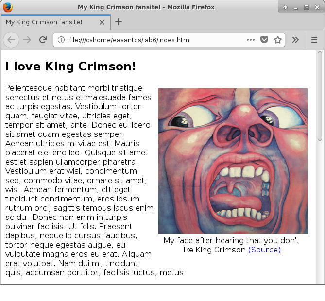
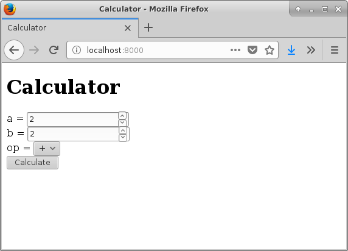
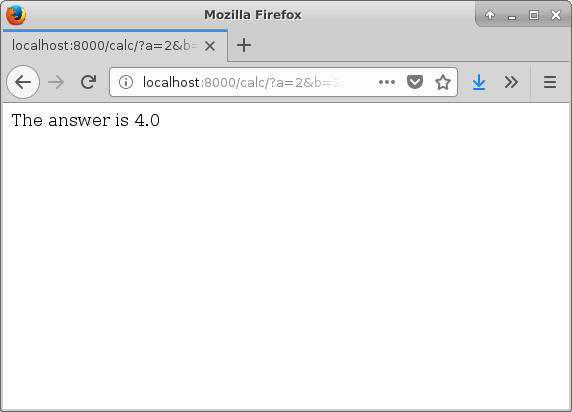

% Lab 6: Writing HTML & CSS from scratch
% CMPUT 296; written by Eddie Antonio Santos
% February 26, 2018

Overview
========

 - Create an HTML and CSS page from scratch
 - Create a form to `GET` information from an HTTP server


Materials
=========

 - A modern web browser (like Firefox or Google Chrome)
 - An internet connection
 - A text editor
 - A Python 3.5+ interpreter that can be run from the command line.
 - Included file:
   <a href="lab-6/server.py" download><code>server.py</code></a>

Procedure
=========

Submit your responses to the questions in this lab on eClass.

> **Question X**: Questions look like this.

**Remember to cite your sources**.


Creating a band fan site from scratch using HTML and CSS
---------------------------------------------------------

In the first part of this lab, we'll be creating a fan site for your
favourite musical group (e.g., Evanescence, Girls' Generation, Maximum
the Hormone, Opeth, Spice Girls, etc.). If you don't have a favourite
band, make a [BTS][] fan site (the particular band doesn't matter).

We'll be writing this site from **scratch**. This means no use of site
generators, themes, Bootstrap, or any pre-written code. **Try as much as
possible to not copy-paste any code from the internet**. All the code
you'll write in your text editor should be typed out by hand (even if
you had to consult the internet on how to do something in HTML and CSS).
There are only two exceptions to this recommendation: links like
<span style="text-overflow:ellipsis;display:inline-block;max-width:100%;white-space:nowrap;overflow:hidden;">https://upload.wikimedia.org/wikipedia/commons/c/ca/%EB%B0%A9%ED%83%84%EC%86%8C%EB%85%84%EB%8B%A8%28BTS%29_180110_%EC%A0%9C_32%ED%9A%8C_%EA%B3%A8%EB%93%A0%EB%94%94%EC%8A%A4%ED%81%AC.png</span>
are okay to copy-paste; [lorem ipsum][] text is also okay to copy-paste.
You will also be required to copy-paste the code _you_ have written as answers to
many questions in this lab.

[BTS]: https://en.wikipedia.org/wiki/BTS_(band)
[lorem ipsum]: https://www.webpagefx.com/tools/lorem-ipsum-generator/

### Create the scaffolding

Create a new text file called `band.html`. Inside this text file, type
the minimal HTML required for a valid HTML 5 page. You can find an
example in [your lecture
notes](http://webdocs.cs.ualberta.ca/~hindle1/2014/HTML-Slides/#/3).
Verify that it is valid HTML 5 by copy-pasting the code you wrote into
the [W3C validator][validator].

[validator]: https://validator.w3.org/#validate_by_input


Do not continue until your minimal HTML passes the validator with
zero errors.

> **Question 1**: Copy-paste your minimal HTML (that passes the W3C
> validator) as the answer to this question.


### Adding content

Write a title for your fan site. Place your title in the `<title>`
element and in a `<h1>` at the top your page. Where should
these elements go in your code? Use the [validator][] to check that you
did it right.

> **Question 2**: What is the difference between the `<title`> and the
> `<h1>` tag?

Now, add some content to the `<body>` of your website. Write *at least*
3 paragraphs of content for your website. If you are feeling uncreative/lazy, you *may*
copy-paste at least 3 paragraphs worth of [lorem ipsum][] text. Either way,
wrap your paragraphs in the [appropriate HTML tags](http://webdocs.cs.ualberta.ca/~hindle1/2014/HTML-Slides/#/9).

> **Question 3**: Copy-paste the contents of your `<body>` tag
> as the answer to this question.


### Apply some basic styles to your page

Create a new CSS file in the same directory as `band.html` called
`styles.css`. Start this file off with:

```css
@charset "UTF-8";
```

You should at very least override the default font for the entire page.
Write the appropriate CSS ruleset that will change the `font-family` of
the entire page. Change the font to `sans-serif`, or any other font of
your choosing.

Create the appropriate `<link>` to make your page use `styles.css`.
Reload the page in your browser and ensure the font has changed
appropriately.

For the next questions, review [the terminology used to describe CSS
syntax](https://codepen.io/eddieantonio/full/NygbJR/).

> **Question 4**: Copy-paste your `<link>` element that includes the
> external CSS file as the answer to this question.

> **Question 5**: What selector  did you use to change the font for the
> entire page? Why did you choose this selector?

> **Question 6**: Copy-paste the ruleset you used to change the font as
> the answer to this question.


### Adding a figure

Add a image of the band, a band member, or the bands' logo to your page.
Search the web to find an appropriate image, and **copy to link to where
you got the image from**. This is so that you can cite the source later.
Download this image to your computer in the same directory as
`band.html` and `style.css`. Add
a [`<figure>`](https://developer.mozilla.org/en-US/docs/Web/HTML/Element/figure)
element near the top of the page to contain your `` element. Your
`` tag within the `<figure>` element must link to the image you
just downloaded onto your computer. Below the `` element (and still
within the `<figure>` element), add a `<figcaption>` that has a written
caption for the image (e.g., "BTS at the 32nd Golden Disk Awards on
January 10, 2018"
[[1]](https://en.wikipedia.org/w/index.php?title=BTS_(band)&oldid=826907650)).
At the end of the `<figcaption>`, create
a [hyperlink](http://webdocs.cs.ualberta.ca/~hindle1/2014/HTML-Slides/#/14)
**citing the source you got the image from**.


> **Question 7**: Copy-paste the entire contents of your `<figure>`
> element as the answer to this question.

<aside>
This is what I mean by "floating". This text will render like an aside,
"floating" to the right of the main text.
</aside>

Now, move the figure---image, caption, and all---to the right side of the
page, allowing the text to flow around it on the left side of the image.


To do this, use the
[`float`](https://developer.mozilla.org/en-US/docs/Web/CSS/float)
property to "float" your `<figure>` to the right of the page.
Add any additional styles to ensure your image and your caption due not
exceed one-half of the screen width. You may want to look at the
[`max-width`](https://developer.mozilla.org/en-US/docs/Web/CSS/max-width)
property. Reload your page, and make sure the figure is floating to the
right of the text.



> **Question 8**: Copy-paste the styles you just wrote for the
> `<figure>`, `<figcaption>`, and/or `` elements.

### Adding a footer

At the bottom of the `<body>` element, add a `<footer>` element. What you
typically put here is a copyright notice, authorship information and
other non-content information.

You will add a message in the footer that says

> Copyright © [the year right now] [your name here].

For example, mine says:

> Copyright © 2018 Eddie Antonio Santos.

To add the copyright symbol (©), use an [HTML entity](https://developer.mozilla.org/en-US/docs/Glossary/Entity).
For the purposes of this lab, **DO NOT** copy-paste the character in the
text above when writing the code for your `<footer>` element.

> **Question 9**: Copy-paste the code you just wrote for the `<footer>`
> element as the answer to this question.

Since the `<footer>` contains the non-content information, make its font
size smaller. Write a ruleset that makes all the text in the footer
a smaller font-size than the rest of the webpage, with one caveat: the
font size *must* scale
[relative to the default font size of the body](https://developer.mozilla.org/en-US/docs/Learn/CSS/Introduction_to_CSS/Values_and_units).
This means you **cannot** use absolute units like `10px` or `8pt`.

> **Question 10**: Copy-paste the ruleset you just wrote to make the
> font size smaller in the `<footer>` element as the answer to this
> question.

### Finishing touches

Add a style to a word of your choosing in the first sentence of the first
paragraph. Choose a word near the beginning of the page and wrap it in
an element appropriate for [applying a class or inline styles](http://webdocs.cs.ualberta.ca/~hindle1/2014/HTML-Slides/#/17).

> **Question 11**: What is the most appropriate element for applying
> styles or special properties to arbitrary inline text in HTML?

Apply a class called `rotated` to the new element you just created. Now
write a ruleset in `styles.css` that will rotate this text. Write an
appropriate selector. Then, add these two declarations to your ruleset
that selects the element:

```css
display: inline-block;
transform: rotate(-12deg);
```


Save `styles.css` and reload the page. Before moving on, ensure that the
particular word you selected is indeed rotated.

> **Question 12**: Copy-paste the ruleset you just wrote to rotate the
> text.

> **Question 13**: Delete the `display: inline-block` declaration. What
> changes when you reload the page? Note that you should **not** delete
> the `transform: rotate(-12deg)` declaration. Add the `display`
> declaration back. What does `display: inline-block` do?


Finally, we're going to make a fancy [initial letter drop
cap](https://en.wikipedia.org/wiki/Initial) like in old European
manuscripts.


You must do this **without modifying the HTML**.  For the purposes of
this lab, "fancy" means it's in a different font family that the rest of
the text, is in a larger font in general, and has a different
background colour than the rest of the document.

Write a ruleset that applies at least a different font family and size,
as well as adds a different background colour to _only_ the first letter
of the first paragraph on the page. In order to create an appropriate
selector, you may want to look at the [course
notes](http://webdocs.cs.ualberta.ca/~hindle1/2014/HTML-Slides/#/32).
You may also want to consult MDN for
[pseudo-classes](https://developer.mozilla.org/en-US/docs/Web/CSS/Pseudo-classes)
and
[pseudo-elements](https://developer.mozilla.org/en-US/docs/Web/CSS/Pseudo-elements)
for use in your selector.


> **Question 14**: Copy-paste your ruleset for the fancy initial letter
> drop-cap as the answer to this question.


Creating a working `<form>` element
---------------------------------

In the second part of the lab, we will be creating a working `<form>`
that will send information as a `GET` request to an HTTP server running
a simple calculator.

<aside>
In case you are wary of running unknown code on your computer (you
should be), the SHA-256 checksum of `server.py` as I wrote it is:

```
334e487a26471a1724d22da4b5418efba63ad2a0b1eb269cf5e989bf3be08058
```

Use [`sha256sum`](https://help.ubuntu.com/community/HowToSHA256SUM) to verify that the file you downloaded has the same
SHA-256 checksum. Please peruse the source code to ensure it is not malicious in nature.
</aside>

First, make sure you have downloaded the HTTP server source code. It can
be downloaded here:
<a href="lab-6/server.py" download><code>server.py</code></a>.

Now run the server. Open a terminal, and navigate to the directory where
you downloaded `server.py`. Then run:

```sh
python3 server.py
```

It should display a message saying:

<pre><output>Listening on http://localhost:8000/</output></pre>

Leave the terminal window open with the server running. It will respond
to `GET` requests.

> **Question 15**: Describe what you see when you navigate to
> <http://localhost:8000/> in your browser.

Now create an HTML document called `index.html`, which must be in the
same directory as `server.py`. Type the same minimal HTML that you used for **Question 1**.

In the `<body>` of `index.html`, add an `<h1>` that says "Calculator".
Save the file `index.html`.

> **Question 16**: Reload <http://localhost:8000/>. The page should have
> changed. Describe what you see in the webpage, and where that content
> originated from.

We will be adding a form that does a `GET` request to
<http://localhost:8000/calc/>.

> **Question 17**: How are parameters sent to the server in a `GET`
> request? Be as specific as possible.

Create a [`<form>`](http://webdocs.cs.ualberta.ca/~hindle1/2014/HTML-Slides/#/38)
element that will make a `GET` request to <http://localhost:8000/calc/>.

> **Question 18**: How do you specify what URI/URL the `<form>` will issue
> a request to?

<http://localhost:8000/calc/> expects arguments called `a`, `b`, and
`op` to be sent to it, and will return an HTTP error if it doesn't get
these. `a` and `b` should be numbers (integer or floating point). `op`
is one of `+`, `-`, `*`, `/`, which indicates the operation to perform.

Create `<input>` elements within the `<form>` element for each of the
parameters `a` and `b`. See [the course notes](http://webdocs.cs.ualberta.ca/~hindle1/2014/HTML-Slides/#/39) for
which attributes you should add to each `<input>` element.
Peruse [this list on MDN](https://developer.mozilla.org/en-US/docs/Web/HTML/Element/input#Form_<input>_types)
to determine what the most appropriate value for the `type` attribute.

Use a `<br/>` to put these two inputs on separate lines.

At the bottom of the `<form>` add the following element:

```html
<input type="submit" value="Calculate">
```

> **Question 19**: Copy-paste the code for your `<form>` element so far
> as the answer to this question.

> **Question 20**: What was the most appropriate value for the `type`
> attribute of the `<input>` elements you created for the `a` and `b`
> parameters?

Now, create
a [`<select>`](http://webdocs.cs.ualberta.ca/~hindle1/2014/HTML-Slides/#/42)
element within the form to allow the user select the operation used in
the calculation. The parameter that this affects is called `op`. Create
an appropriate `<option>` element for each of the four operations
supported: `+`, `-`, `*`, `/`.

> **Question 21**: Copy-paste the code for your `<select>` element
> as the answer to this question.

If you've done the last steps right, you should have a functional form.
You can enter appropriate values, press "Calculate", and it will
send you to a page with the answer.




